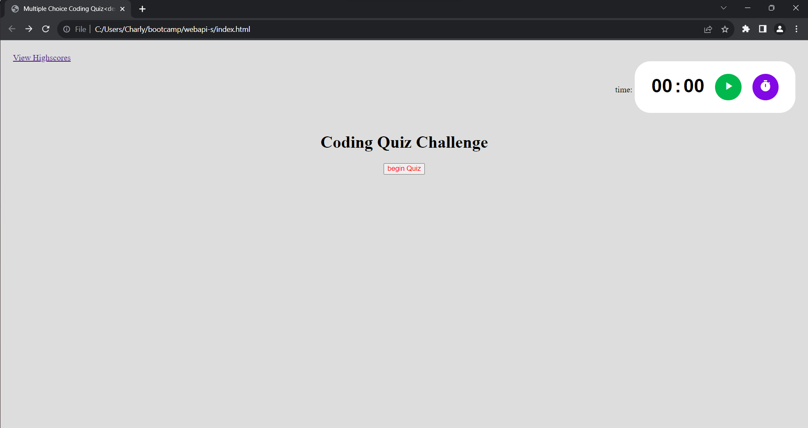

# webapi-s
## Sean's SuperFast Coding Quiz

This is a quiz that asks three questions. It gives a list of multiple
choice answers allowing the user to select one and submit score at the end 
of the quiz. It also documents the high score in local storage.
My tutor Trinh was a big help with this project and I also utilized some code from online sources.

file:///C:/Users/Charly/bootcamp/webapi-s/index.html
Charly@DESKTOP-ELCGQ2F MINGW64 ~/bootcamp/webapi-s (main)
https://github.com/nightsha/Sean-s-SuperFast-Coding-Quiz-webapi-s.git
